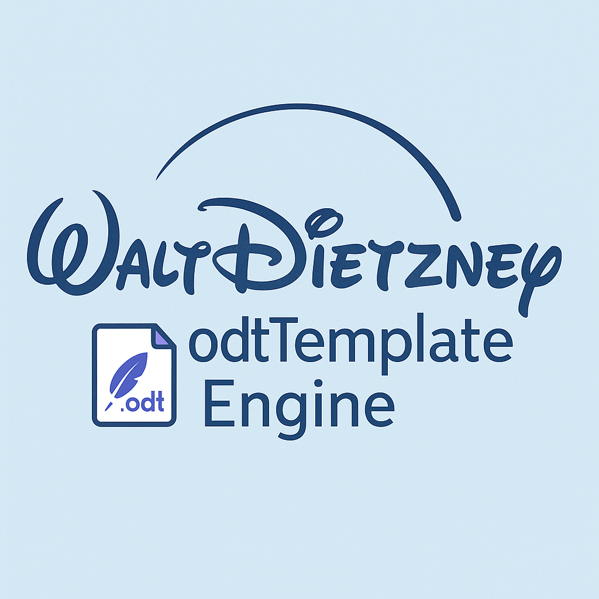

---
<pre>
       )        (
    ( /(    (   )\ )     )
    )\())  ))\ (()/(  ( /(   ✨
   ((_)\  /((_) )(_)) )(_))  WaltDietzney
    _((_)_))  ((_)_  ((_)_    ODT Template Engine
   | || (_)_ _| | |   | | |   Document spells for .odt files 🧙‍♂️📄
   | __ / _` | | |__ | | |__  PHP-powered, template-magic.
   |_||_\__,_|_|____||_|____|

</pre>

---

# 🧩 ODT Template Engine for PHP
---
<table>
<tr>
<td width="30%">
  
</td>
<td>
  <h3>WaltDietzney ODT Template Engine</h3>
  <p>
    A lightweight PHP library to bring magic to your LibreOffice and OpenOffice documents.  
    Define templates once, inject variables dynamically, and generate polished ODT files effortlessly.  
    Supports variables, filters, loops, conditional logic, images, and even complex structures like formatted paragraphs, tables and tab stops.
  </p>
  <p>
  Inspired by Smarty, optimized for modern PHP workflows.
  </p>
</td>
</tr>
</table>


[](LICENSE)
[](https://www.php.net/)
[](https://en.wikipedia.org/wiki/OpenDocument)
[](#)

---
**Disclaimer:**  
This project "WaltDietzney odtTemplate Engine" is an independent open-source project and is not affiliated with, endorsed by, or related to The Walt Disney Company. The name "WaltDietzney" is a playful word creation and solely refers to this software project.

---

## ✨ Features

- 🔄 Replace variables like `{{name}}`, even with filters
- 🔁 Loops with `{{#foreach:items}} ... {{#endforeach}}`
- 🧠 Conditional logic: `if`, `elseif`, `else`, `ifnot`
- 🔤 Filters: `{{upper:name}}`, `{{date:birth|d.m.Y}}`, etc.
- 🖼 Dynamic image insertion and styling by name
- 🧱 `setElement()` and `addElement()` for rich content like:
  - ✅ Formatted paragraphs
  - ✅ Numbered/bullet lists
  - ✅ Tables
  - ✅ Images with precise positioning
- 🌐 HTML-to-ODT import support
- 🧼 Automatic span normalization (LibreOffice fixes)
- 📄 Full header, footer and styles support

---

## 📦 Installation

```bash
composer require waltdietzney/odt-template-engine
```

---

## 🌍 Why Open Document Format (ODF)?

ODF (`.odt`) is more than just a file format — it’s a future-proof, open standard for editable documents:

- **👐 Open & Transparent**  
  Based on open standards (ISO/IEC 26300), ensuring long-term accessibility without vendor lock-in.

- **📁 Fully Editable Output**  
  Unlike PDF, ODT documents remain fully editable — perfect for collaboration, review, or customization by the end user.

- **💻 Platform Independent**  
  Works on Windows, Linux, macOS — with LibreOffice, OpenOffice, or even Microsoft Word (ODF support included).

- **🏛️ Ideal for Government & Education**  
  Many public institutions rely on open formats for compliance, interoperability, and archival.

- **🔧 Developer-Friendly**  
  Under the hood, ODT files are ZIP containers with clean XML inside — perfect for dynamic content insertion.

---

## 🧰 Use Cases

You can use this engine to generate complex `.odt` documents dynamically — fully styled, human-readable, and editable.

- ✅ Invoices or quotes based on template variables  
- 📄 Contracts or forms with pre-filled user data  
- 📝 Certificates for workshops, training, or events  
- 📊 Data-driven reports (merge database content with layout)  
- 🏢 Automated letters or business offers  
- 🔄 Batch document export from CMS, CRM, or ERP systems  
- 🌐 Integrate document generation directly into your web app

---

---

## 📂 Project Structure

```text
src/
├── OdtTemplate.php               → Base template engine
├── AbstractOdtTemplate.php       → Core logic
├── Elements/
│   ├── OdtElement.php            → Abstract base for elements
│   ├── RichText.php              → Rich text with formatting
│   ├── Paragraph.php             → Paragraphs with tabs, alignment
│   ├── RichTable.php             → Complex table creation
|   |── RichTableCell.php         → Styling table cells
│   ├── ImageElement.php          → Positioned images
|── Importer/
|   |── HtmlImport.php            → Imports Html elements
|── Util
|   |── StyleMapper.php           → Maps styles do odt-styles
|   |── StyleWriter.php           → Writes stlyes do styles.xml
```

---

## 🚀 Quick Example

Place your variables inside a template file using double curly braces, like {{customer_name}}, {{currency:total}}, or even within loops:
<code>
{{#foreach:items}}
Name: {{name}}
Price: {{price}}
{{#endforeach}}
</code>
You can also use conditional statements:
<code>
{{#if:is_vip}}
{{customer_name}}
{{#else}}
Nothing found
{{#endif}}
</code>
You can then assign values to the template using the following methods:


```php
use OdtTemplateEngine\OdtTemplate;

$template = new OdtTemplate('templates/example.odt');
$template->load();

$template->setValues([
    'customer_name' => 'Jane Smith',
    'total' => '129.90',
    'is_vip' => true
]);

$template->setRepeating('items', [
    ['name' => 'Tea', 'price' => '3.50'],
    ['name' => 'Coffee', 'price' => '4.20'],
]);

$template->replaceImageByName('logo', 'assets/logo.png', ['width' => '5cm']);

$template->save('output/invoice_result.odt');
```

## 🖼 Image Handling


---

You have several options for inserting images into your document. With `replaceImageByName`, you can replace an image in your template with another one by referencing the name of the original image.

Using `setImage`, you can assign an image directly to a variable like `{{image}}` in the template. You can also set image options such as width, height, or anchor.

In combination with other methods, you can assign an image to a variable using the `new ImageElement()` method together with `setElement`.

---

```php
//inserting via richText as embedded element
$image = new ImageElement('path/to/photo.jpg');
$style = [
    'width' => '5cm',
    'height' => '4cm',
    'align' => 'right',
    'anchor' => 'paragraph',
];
$image->setStyle($style);

$template->setElement('logo',$image);

//or use direct as image
$template -> setImage('logo','path/to/photo.jpg', $style);

//or if you want to replace an existing image by its name
$template->replaceImageByName('logo', 'assets/logo.png', ['width' => '5cm']);
```


## 🖊 Advanced Paragraph & RichText

---
With  RichText elements, you can define complex structures and assign a variable a combination of different paragraphs that include various elements such as tables, tab stops, images, and styling options. This allows you to create expressive, professional-looking documents on the fly.

---

```php
use OdtTemplateEngine\OdtTemplate;
use OdtTemplateEngine\Elements\RichText;

$template = new OdtTemplate('templates/textblock.odt');
$template->load();

$rich = (new RichText())
    ->addText('Hello ', ['bold' => true])
    ->addText('world!', ['italic' => true])
    ->addLineBreak()
    ->addBulletList(['One', 'Two'])
    ->addLineBreak()


$template->setElement('intro', $rich);
$template->save('output/output_textblock.odt');
```

---

## 📐 Paragraphs with Tabs
---
A range of methods is available for working with tab stops. Here too, a simple variable can be replaced by a complex, composite element.

---

```php
require '../vendor/autoload.php';

use OdtTemplateEngine\OdtTemplate;
use OdtTemplateEngine\Elements\RichText;
use OdtTemplateEngine\Elements\Paragraph;

// 1️⃣ Load your template
$template = new OdtTemplate('templates/template_with_tabstops.odt');
$template->load();


$title = new Paragraph('Title');
$title->addText('Different Ways to set Tabs');

// 2️⃣ Build a complex RichText block

$par1 = new Paragraph();

// Define shared tab stops: 5cm and 11cm from left margin
$tabStops = [
    ['position' => 5.0, 'alignment' => 'left', 'text' => 'Itam A', 'style' => ['bold' => true]],
    ['position' => 11.0, 'alignment' => 'right', 'text' => '€12.50', 'style' => ['color' => '#cfcfcf'], 'italic' => true]
];

// Single line with two values
$par1->addTabsWithTexts(
    $tabStops
);

// Tabular block: header + data rows
$rows = [
    ['Product', 'Price'],
    ['Widget', '€9.99'],
    ['Gadget', '€14.20'],
];

$par2 = new Paragraph();

$par2->addTabularLines(
    $rows,
    $tabStops,
    [
        'color' => '#0066cc',         // text color
        'InvoiceTable'
    ]
);
$par3 = new Paragraph();
// Key-Value summary
$par3->addKeyValueLine('Subtotal', '€24.19', 11.0, ['italic' => true, 'bold' => true]);

//create a complex structure via RichText
$rich = new RichText();
$rich->addParagraph($title)
    ->addParagraphBreak(4)
    ->addParagraph($par1)
    ->addParagraphBreak(2)
    ->addParagraph($par2)
    ->addParagraphBreak(2)
    ->addParagraph($par3);

// 3️⃣ Inject into your template
$template->setElement('tabular_block', $rich);

// 4️⃣ Save result
$template->save('output/final_invoice.odt');
```


## 🌍 HTML Import
---

For easy handling of online elements, you can assign complete HTML structures to a variable. This also includes anchors, images, and inline style elements.

---

```php
use OdtTemplateEngine\Import\HtmlImporter;

$html = '<h1>Imported Title</h1><p>This comes from HTML.</p>';
$element = HtmlImporter::fromHtml($html);
$template->setElement('html_block', $element);
```

## 📋 Complex tables with formatted cells

---

By combining RichTable and RichTableCell elements, you can assign styled tables to a simple variable. This makes it easy to create compelling, visually appealing documents with tables.

---

```php
use OdtTemplateEngine\OdtTemplate;
use OdtTemplateEngine\Elements\RichText;
use OdtTemplateEngine\Elements\Paragraph;
use OdtTemplateEngine\Elements\RichTable;
use OdtTemplateEngine\Elements\RichTableCell as rtc;

$template = new OdtTemplate('templates/template_table_styled.odt');
$template->load();

$table = new RichTable();

// Kopfzeile
$table->addRow([
    new rtc('Task', ['background' => '#ddeeff', 'text-align' => 'center', 'border' => '0.05pt solid #000']),
    new rtc('Status', ['background' => '#ddeeff', 'text-align' => 'center', 'border' => '0.05pt solid #000']),
]);

// Zeile mit RichText
$rich = (new RichText())->addText('Html', ['bold' => true]);
$table->addRow([
    new rtc($rich, ['background' => '#c8facc', 'align' => 'end']),
    new rtc('✔', ['background' => '#c8facc', 'text-align' => 'center']),
]);

// Weitere Zeilen
$table->addRow([
    new rtc('Table Styling'),
    new rtc('✔', ['background' => '#c8facc', 'text-align' => 'center']),
]);

$table->addRow([
    new rtc('Pending'),
    new rtc('☐', ['background' => '#fce3e3', 'align' => 'center']),
]);

$template->setElement('tableblock', $table);
$template->save('output/output_table_styled.odt');
```


## 🔠 Filters
---

The filter elements were inspired by the Smarty PHP template engine. They allow you to define how variables are displayed within the template and output them in the desired format.

---

| Filter     | Syntax                  | Output               |
|------------|-------------------------|----------------------|
| `upper`    | `{{upper:name}}`        | `"ANNA"`             |
| `lower`    | `{{lower:email}}`       | `"anna@example.com"` |
| `nl2br`    | `{{nl2br:note}}`        | `<text:line-break/>` |
| `date`     | `{{date:birth\|d.m.Y}}`  | `"01.01.1990"`       |
| `number`   | `{{number:price\|2}}`    | `"4.20"`             |
| `currency` | `{{currency:price}}`    |  `"4.20 €"`          |

---

## 🤖 Conditional Logic
---

```text
{{#if:is_vip}}
  VIP Customer
{{#elseif:total>100}}
  Premium Customer
{{#else}}
  Regular Customer
{{#endif}}
```

Also supports negation: `{{#ifnot:is_blocked}}`

---

## 🧼 XML Span Fix

LibreOffice often splits placeholders across `<text:span>` tags. This engine auto-normalizes that, so you don't need to worry.

---

## 🛠 Roadmap

- [ ] Nested logic/loops
- [ ] Style presets and style exporting
- [ ] Resume generator with GUI
- [ ] Web-based template manager
- [ ] Export all template variables

---

## 🧑‍💻 Author

Created by **Walter Dietz**  
✉️ GitHub: [@WaltDietzney](https://github.com/WaltDietzney)

Feel free to contribute, fork, or drop me a message.

---

## 📜 License

MIT – free to use, modify, and share.

---

## 💡 Like it?

Give it a ⭐ on GitHub if you like this project – and stay tuned for new modules, visual tools, and more!
